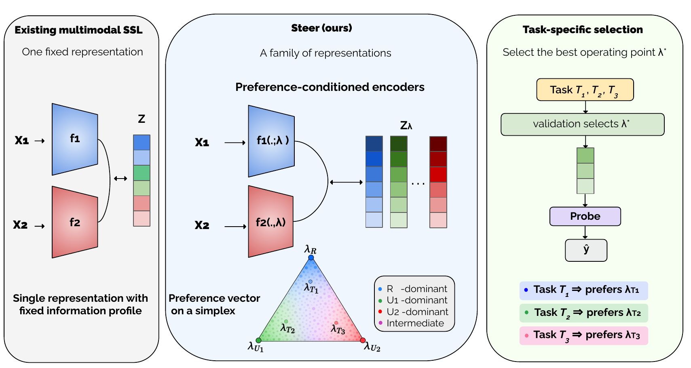

# STEER

**Preference-conditioned multimodal self-supervised learning for shared and modality-specific information**

STEER learns a family of multimodal representations within a single pretrained
model, allowing different downstream tasks to select different balances of
shared and modality-specific information without retraining the representation
model.

A preference is defined as

<p align="center">
  <b>λ = (λ<sub>R</sub>, λ<sub>U1</sub>, λ<sub>U2</sub>)</b>
</p>

where **λ<sub>R</sub>** emphasizes information shared across modalities,
while **λ<sub>U1</sub>** and **λ<sub>U2</sub>** emphasize information specific
to modalities 1 and 2, respectively.

Rather than committing to one information profile during pretraining, STEER
learns multiple operating points jointly. Once a downstream task is available,
the pretrained model is frozen and an appropriate operating point is selected
using downstream validation data.

<p align="center">
  
</p>

<p align="center">
  <em>
  Overview of STEER. Preference-conditioned encoders learn a family of
  representations spanning different balances of shared and modality-specific
  information. The operating point is selected after pretraining according to
  the downstream task.
  </em>
</p>

---

## Overview

STEER is motivated by multimodal pretraining settings in which future
downstream tasks are not known in advance. Different tasks may rely on
different combinations of information:

- **Redundant information (R):** information available across both modalities.
- **Modality-specific information (U1):** information specific to modality 1.
- **Modality-specific information (U2):** information specific to modality 2.

STEER introduces the preference directly into the modality-specific encoders
through low-rank preference-conditioned adaptations. A single set of model
parameters therefore supports multiple information profiles.

At downstream time:

1. the pretrained representation model is frozen;
2. candidate operating points are evaluated using lightweight probes;
3. a task-specific preference is selected from validation data;
4. the selected operating point is used for final evaluation.

The selected preference provides an operational description of the balance of
shared and modality-specific information used by a task.


---

## Quick start

### 1. Clone and install

```bash
git clone <ANONYMOUS_REPOSITORY_URL>
cd Steer
conda create -n steer python=3.10 && conda activate steer
pip install -r requirements.txt
```

A GPU is assumed throughout; every command below takes `--device cpu` instead.

### 2. Minimal example — Trifeature

Trifeature is a synthetic bimodal dataset whose generative factors are known:
shape is drawn in both views (redundant, **R**), deformation only in view 1
(**U1**), texture only in view 2 (**U2**). It is the cheapest way to see a
single model serve three tasks at three different preferences.

```bash
python pareto_ssl/benchmark.py \
    --data_dir data/tri15_corr00 \
    --out_dir runs/steer_trifeature \
    --methods simclr_simplex_enc_decomp_R \
    --epochs 100 --lr 3e-4 --batch_size 128 \
    --latent_dim 512 --proj_dim 256 \
    --encoder_param encoder \
    --preference_schedule annealed --annealing_temperature 1.0 \
    --lora_alpha 8 --simplex_side 5 --lam_club 0.5 \
    --readout dim --probe_shots 1 \
    --modality_pair M1,M2 --seed 42 --device cuda
```

One run trains the whole preference family and then probes all 15 operating
points. Each task peaks at a different preference.

---

## Data

| dataset | how to obtain |
|---|---|
| Trifeature | `pareto_ssl/trifeature/generate_corr_variant.py` |
| CMU-MOSEI, UR-FUNNY, AV-MNIST | [MultiBench](https://github.com/pliang279/MultiBench) |
| Neuroimaging | not redistributable |

For the MultiBench datasets, copy `pareto_ssl/multibench/data_catalog.example.json`
to `data_catalog.json` and point each entry at your copy of the data. AV-MNIST is
read as six arrays: `image/{train,test}_data.npy`, `audio/{train,test}_data.npy`
and `{train,test}_labels.npy`.

Nothing in this repository requires a third-party checkout: the MultiBench
loaders and the sequence encoder are implemented here.

---

## Reproducibility notebooks

`demo/` reproduces the main evaluation pipeline from pretrained checkpoints.

| notebook | what it does |
|---|---|
| `demo/steer_trifeature.ipynb` | trains STEER on Trifeature and probes the full simplex |
| `demo/steer_multibench.ipynb` | loads checkpoints and reproduces the reported MultiBench table |

The MultiBench notebook does **not** retrain. It loads pretrained checkpoints,
sweeps the 15 preferences on validation, selects the operating point by
consensus across seeds, re-probes every seed at that single preference, and
reports the held-out test score. The training command that produced the
checkpoints is shown in the notebook but not executed — one seed is 5.5 h on
UR-FUNNY, 10.8 h on CMU-MOSEI and 22.2 h on AV-MNIST at 200 epochs.

---

## Full experiments

### MultiBench

Train one preference-conditioned model:

```bash
python pareto_ssl/multibench/benchmark_multibench.py \
    --approach 5 --method simclr_single_per_batch --dataset mosei \
    --film_mode simplex_enc_decomp_R --arch factorcl_based \
    --enc_dim 40 --proj_dim 64 --epochs 200 --lr 3e-4 --batch_size 128 \
    --lora_branches 2 --lora_rank 4 --lora_layers 3 --lora_lr_mult 10 \
    --preference_schedule annealed --num_preferences 5 --prefs_per_batch 5 \
    --lam_club 0.25 --out_dir runs/steer_mosei_seed42 --seed 42 --device cuda
```

Probe every preference on validation:

```bash
python pareto_ssl/multibench/probe.py \
    --enc_dir runs/steer_mosei_seed42 --dataset mosei --approach 5 \
    --film_mode simplex_enc_decomp_R --readout dim \
    --mode validation --modality both --device cuda
```

Select one operating point across seeds, then re-probe there:

```bash
python pareto_ssl/multibench/consensus_pick.py "runs/steer_mosei_seed4*" --readout dim
python pareto_ssl/multibench/probe.py \
    --enc_dir runs/steer_mosei_seed42 --dataset mosei --approach 5 \
    --film_mode simplex_enc_decomp_R --readout dim --mode validation \
    --fixed_lam 0,0.25,0.75 --modality both --device cuda
```

`consensus_pick.py` prints only the preference, so it can be substituted
directly into `--fixed_lam`.

Reported settings: λ_CLUB 0.25, `dim` read-out, 5 preferences per minibatch,
200 epochs, seeds 42–46. CMU-MOSEI is scored on the non-neutral test set;
UR-FUNNY on accuracy; AV-MNIST on top-1. AV-MNIST fits its probe on the train
split (`--probe_fit train`, standard linear evaluation), the affect datasets on
validation.

### Neuroimaging

```bash
python steer_neuro/train_steer_neuro.py --scope bottleneck --save_dir runs/steer_neuro
python steer_neuro/extract_embeddings.py --ckpt runs/steer_neuro/last.pt --out_dir runs/steer_neuro/emb
python steer_neuro/select_lambda_val_test.py --ckpt runs/steer_neuro/last.pt --task prematurity
python steer_neuro/eval_downstream.py --out_csv downstream_comparison.csv
```

`--scope` selects which layers carry the preference-conditioned adapters:
`bottleneck`, `last_stage` or `full`.

---

## Repository structure

```text
Steer/
│
├── assets/STEER.png
├── requirements.txt
│
├── demo/
│   ├── steer_trifeature.ipynb      # train + probe the simplex
│   └── steer_multibench.ipynb      # reproduce the reported table from checkpoints
│
├── pareto_ssl/                     # Trifeature + MultiBench
│   ├── benchmark.py                # Trifeature training and probing
│   ├── datasets.py  losses.py  networks.py  factorcl.py  epo.py
│   ├── pareto_config.yaml
│   ├── plot_pareto_front_3d.py     # the 3D trade-off figure
│   │
│   ├── trifeature/generate_corr_variant.py
│   │
│   └── multibench/
│       ├── benchmark_multibench.py # preference-conditioned training
│       ├── probe.py                # preference sweep and probes
│       ├── consensus_pick.py       # operating-point selection across seeds
│       ├── affect_data.py          # MOSI / MOSEI / UR-FUNNY / MUsTARD loaders
│       ├── mb_transformer.py       # sequence encoder
│       ├── image_backends.py       # AV-MNIST, ENRICO
│       ├── data_catalog.example.json
│       ├── task_lambda_probe.py    # per-task preference analysis
│       ├── mosei_multitask.py  build_mosei_multitask.py  multitask_registry.py
│       └── pid_analysis/
│
└── steer_neuro/                    # neuroimaging experiments
    ├── train_steer_neuro.py  train_baselines_neuro.py
    ├── model.py  encoders.py  networks.py  losses.py  wrap_lora.py  simplex.py
    ├── paired_dataset.py
    ├── extract_embeddings.py  eval_steer_neuro.py  eval_downstream.py
    ├── select_lambda.py  select_lambda_val_test.py
    └── probe_baselines.py  diagnostics.py
```
